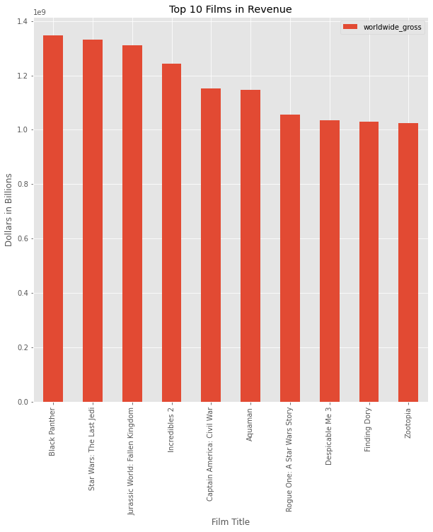
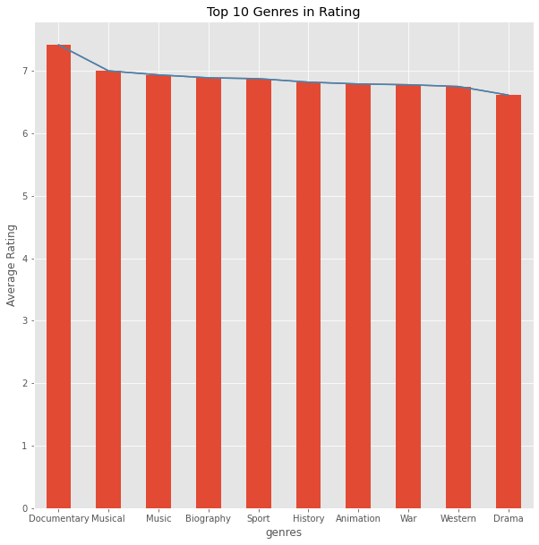
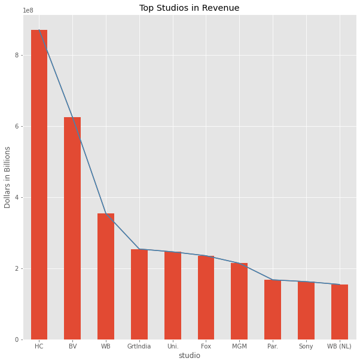

# Movie_Project
 Analysis of movies assignment

Author: Tisa Yip

## Overview

Descriptive analysis of popular films over the last 3 years to gain insight into what type of movie would be best to begin Microsoft's foray into film making.
    <li>Top 10 movies</li>
    <li>Top 10 genres</li>
    <li>Top 10 film studios</li>

## Business Problem

Microsoft want insights on where to begin their movie making journey. 
My data analysis queries were based on popularity, whether it be monetary or subjective.
These questions are important to form a basis on what is successful and to make recommendations tapping into that.

## Data Understanding

The data used in this analysis is from IMDB and Box Office Mojo.  These sites contain relevant information about recent commercialised films and gives a breakdown of their revenue, ratings, titles and year released.

## Data Modeling
I used bar charts for my analysis as they give a clear picture about what is highest.

Firstly, I wanted to find the top 10 films based on revenue. This is a great indication about what type of movies consumers buy into.
Next, I wanted the results of top 10 genres based on viewer ratings. There is a table of the top 10 films with their genre so I can see which genres correlate.
lastly, I wanted to find top 10 film studios in relation to revenue.

## Evaluation
The top 10 films have all had over 1 Billion dollars in worldwide revenue.

Of the top 10 movies 4 are animation and animation is in the top 10 genres under user ratings. Also adventure featured in all Top 10 movies.

BV (Buena Vista) is the second highest grossing film studio and within the top 10 movies, 7 were from BV.

## Conclusions
<li> Start with making movies in animation with an adventure storyline</li>
<li> Choose a niche and make that your target market </li>
<li> Based on the top 10 grossing films, making movies from popular comic book characters is a good option.</li>

## For More Information
See the full analysis in the <a href="project1_code.ipynb">Jupyter Notebook</a> or review this <a href="Movie_Analysis_Presentation.pdf">presentation.</a>

For additional info, contact Tisa Yip at 
<a href="mailto:clawspawsandjaws@gmail.com"> clawspawsandjaws@gmail.com </a>
